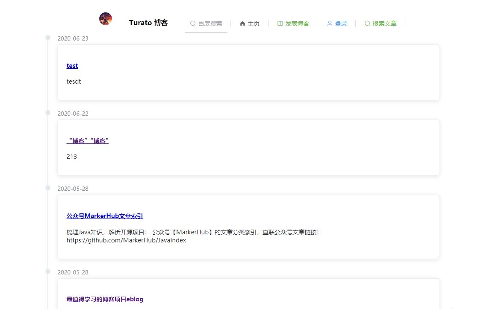
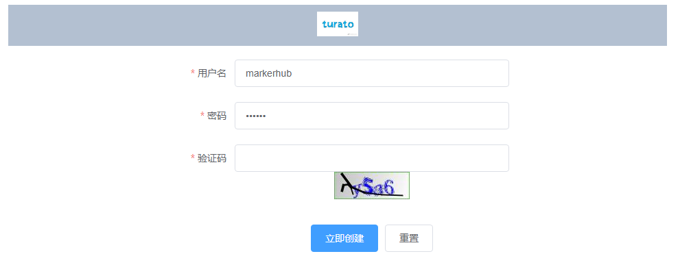
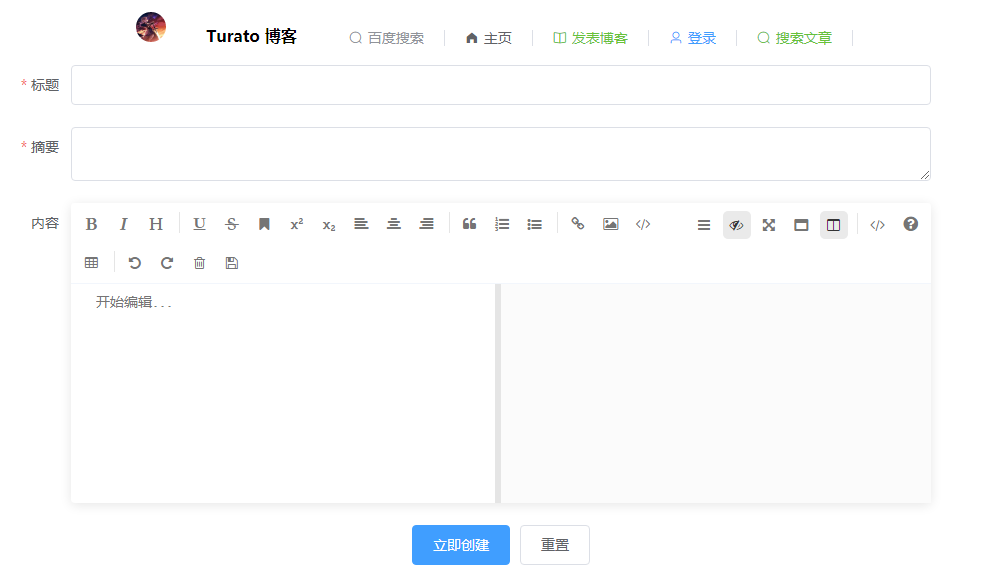
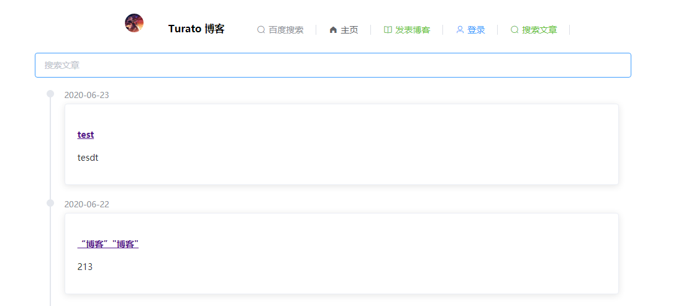
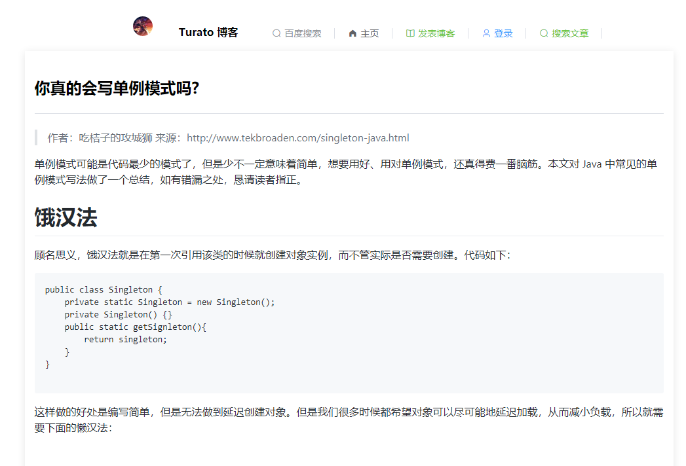

[toc]

# 前言

本项目为我在学习 SpringBoot 的过程中练手的一个 demo，比较适合新手。

项目基于：MarkerHub 的项目[vueblog](https://github.com/MarkerHub/vueblog),一个基于SpringBoot + Vue开发的前后端分离博客项目，视频。

项目结构：

    ├─ doc_img readme 	文档的图片存放目录
    ├─ test 			后端 api 测试文件
    ├─ vueblog-java		后端项目代码
    ├─ vueblog-vue  	前端项目代码
## 文档和视频资源

[MarkerHub](https://github.com/MarkerHub) 老师的 vueblog 项目文档：

[MarkerHub](https://github.com/MarkerHub) 老师的 vueblog 项目视频：

---

本项目的文档（正在完善中）：基于 MarkerHub 的 vueblog 项目的文档进行改进。

[项目的后端开发](https://www.yuque.com/turato/blog/vp39ko)

[项目的前端开发](https://www.yuque.com/turato/blog/dh2x11)

[项目的部署和测试](https://www.yuque.com/turato/blog/xve0t0)

sql语句目录：vueblog\vueblog-java\src\main\resources\vueblog.sql

测试http脚本：vueblog\test\back-end-api-test\rest-api_1.http （使用 IDEA REST Client 测试后端接口）

## 技术栈
- SpringBoot
- Mybatis plus
- Shiro
- Redis
- Hibernate Validatior
- jwt
- Swagger
- Maven

## 功能

在 MarkerHub 的项目[vueblog](https://github.com/MarkerHub/vueblog)的基础上完成了：
- 博客的删和查
- 登录验证码校验
- 博客界面美化
- 集成 swagger

# 项目运行

## 效果
### 主页：

### 博主登录：

### 文章编辑：

### 文章搜索：

### 文章详情页：

## 前端部署

在 vueblog-vue 的目录下执行下面的命令：

编译：npm build
运行：npm run serve

访问：http://localhost:8080

## 后端部署

对于初学者，推荐使用 [phpstudy](https://www.xp.cn/) 集成环境：一键安装本项目所需的mysql，redis环境。

后端接口地址：http://localhost:8081

# 鸣谢

感谢 **MarkerHub** 老师的项目 [vueblog](https://github.com/MarkerHub/vueblog)，从其项目的文档和视频中，受益匪浅。欢迎大家去 star

